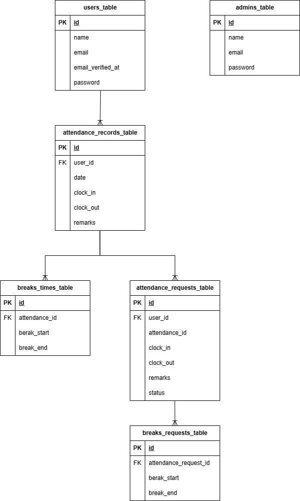

# coachtech勤怠管理アプリ

## アプリ概要

勤怠の打刻、勤怠一覧の確認、勤怠修正申請および承認機能を備えた勤怠管理アプリです。 
一般ユーザーと管理者で利用できる機能が異なります。

 

### 機能一覧

#### 一般ユーザー

- 会員登録
- ログイン / ログアウト
- メール認証
- 出勤打刻
- 退勤打刻
- 休憩開始 / 終了
- 勤怠一覧表示（月次）
- 勤怠詳細表示
- 勤怠修正申請
- 修正申請一覧表示

 

#### 管理者

- ログイン / ログアウト
- スタッフ一覧表示
- スタッフ別勤怠一覧表示
- 勤怠詳細表示
- 勤怠修正
- 修正申請一覧表示
- 修正申請承認

 

## 環境構築

### Dockerビルド

- git clone git@github.com:RumOff/Attendance-management-app.git
- docker-compose up -d --build

### Laravel環境構築

- docker-compose exec php bash
- composer install
- cp .env.example .env
- .envの環境変数を適宜変更
- php artisan key:generate
- php artisan migrate
- php artisan db:seed

### エラー時の対処法
- 権限エラー(Permission denied) 
    chmod -R 777 storage 
    chmod -R 777 bootstrap/cache 
 

- メール送信エラー(Cannot send message without a sender address) 
    ▼.env 
    MAIL_FROM_ADDRESS=test@example.com 
    MAIL_FROM_NAME="Attendance Management App" 
 

## 開発環境(VSCode)
本プロジェクトは **Dev Containers** を使用して開発しています。 
VSCodeで以下の手順を実行するとコンテナに接続できます。

1. VSCodeでプロジェクトを開く
2. 左下の「><」または Ctrl+Shift+P を押下
3. 「Dev Containers: Attach to Running Container」を選択
4. `php` コンテナにアタッチ

 

## 開発環境(URL)

- 一般ユーザーログイン画面: http://localhost/login

  メールアドレス: nohara@example.com
  パスワード: password

- 一般ユーザー登録画面: http://localhost/register
- 管理者ログイン画面: http://localhost/admin/login 

  メールアドレス: admin@test.com
  パスワード: password

- phpMyAdmin: http://localhost:8080/
- Mailhog: http://localhost:8025

 

## 使用技術(実行環境)

- PHP 8.1.34
- Laravel 8.83.29
- MySQL Ver 8.0.26
- nginx 1.21.1

 

## ER図

